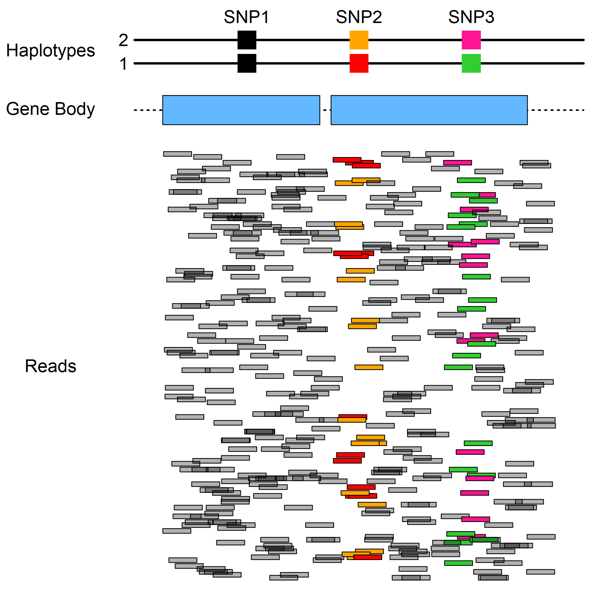

<div align="left">
<a href=""></a>
</div>

<!-- badges: start -->


[](https://doi.org/10.1101/2022.03.31.486605)
[](https://www.repostatus.org/#active)
[](https://github.com/pllittle/CSeQTL)
[](https://github.com/pllittle/CSeQTL/commits/master)
<!-- badges: end -->

## Introduction

Expression quantitative trait loci (eQTL) mapping is the search 
for genomic loci associated with gene expression. Traditional 
methods perform eQTL mapping on bulk tissue gene expression 
without accounting for the underlying sources of gene expression 
per cell type. Attempts to perform ``cell type-aware'' eQTL 
mapping commonly use linear models that transform the gene 
expression while adjusting for the genotype, a proposed measure 
for cell type prevalence (e.g. a marker gene's expression), and 
their interaction and proceed to perform hypothesis testing.

Our R package performs cell type-specific eQTL mapping on bulk 
RNA-sequencing samples by jointly modeling total read count (TReC) 
and allele-specific read count (ASReC). Our method, **CSeQTL**, 
introduces novel features and fully extends **TReCASE** 
[[HTML](https://www.ncbi.nlm.nih.gov/pmc/articles/PMC3218220/), 
[PDF](https://www.ncbi.nlm.nih.gov/pmc/articles/PMC3218220/pdf/nihms-307768.pdf), 
[Software](https://github.com/Sun-lab/asSeq)] and **pTReCASE** 
[[HTML](https://www.ncbi.nlm.nih.gov/pmc/articles/PMC7410098/), 
[PDF](https://www.ncbi.nlm.nih.gov/pmc/articles/PMC7410098/pdf/nihms-1028292.pdf), 
[Software](https://github.com/Sun-lab/pTReCASE)] methodologies.

<p align="center">
<a href="https://raw.githubusercontent.com/pllittle/CSeQTL/master/images/ex_CSeQTL_reads.png"></a>
<p align="center"><em>Example of total read counts and allele-specific or haplotype read counts.</em></p>
</p>

## Required Input Data

1. TReC data
2. ASReC data (haplotype 1 and 2 read counts)
3. Phased genotypes
4. Sample covariates: 
	 * observed confounders, 
	 * genotype principal components (PCs),
	 * latent batch effects (derived from residual TReC PCs)
5. Cell type proportions

## Installation

<details>
<summary>Click to expand!</summary>

```R
req_packs = c("devtools","Rcpp","RcppArmadillo",
	"smarter","CSeQTL")
build_vign = ifelse(Sys.getenv("RSTUDIO_PANDOC") == "",FALSE,TRUE)

for(pack in req_packs){
	
	chk_pack = tryCatch(find.package(pack),
		error = function(ee){NULL})
	
	if( !is.null(chk_pack) ){
		library(package = pack,
			character.only = TRUE)
		next
	}
	
	if( pack %in% c("smarter","CSeQTL") ){
		repo = sprintf("pllittle/%s",pack)
		install_github(repo = repo,
			build_vignettes = build_vign,
			dependencies = TRUE)
	} else {
		install.packages(pkgs = pack,
			dependencies = TRUE)
	}
	
}

```

</details>

## Vignette

```R
# An Introduction
vignette(topic = "intro",package = "CSeQTL")
```

## Citation
Little, P., Liu, S., [Zhabotynsky, V.](https://github.com/yaceya), 
[Li, Y.](https://github.com/yunliUNC), 
[Lin, D.Y.](https://sph.unc.edu/adv_profile/danyu-lin-phd/), 
[Sun, W.](https://github.com/sunway1999) (2023). A computational method 
for cell type-specific expression quantitative trait loci mapping using 
bulk RNA-seq data. *Nature Communications*. 
[[HTML](https://www.nature.com/articles/s41467-023-38795-w), 
[SUPP](https://static-content.springer.com/esm/art%3A10.1038%2Fs41467-023-38795-w/MediaObjects/41467_2023_38795_MOESM1_ESM.pdf)]


